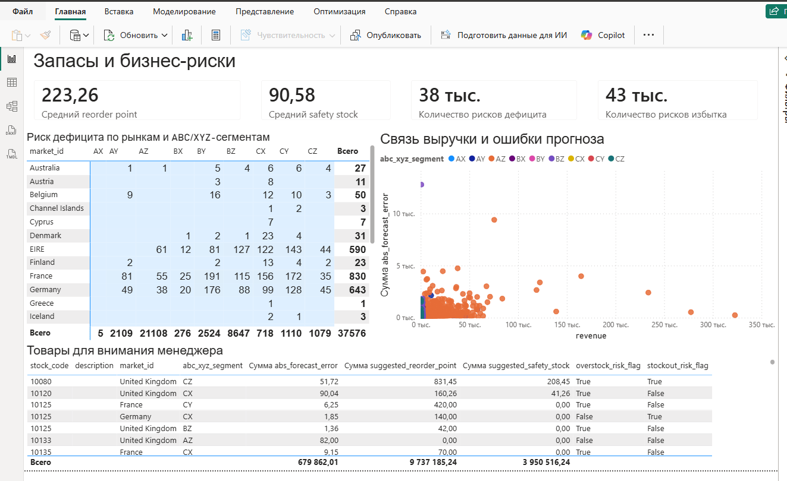
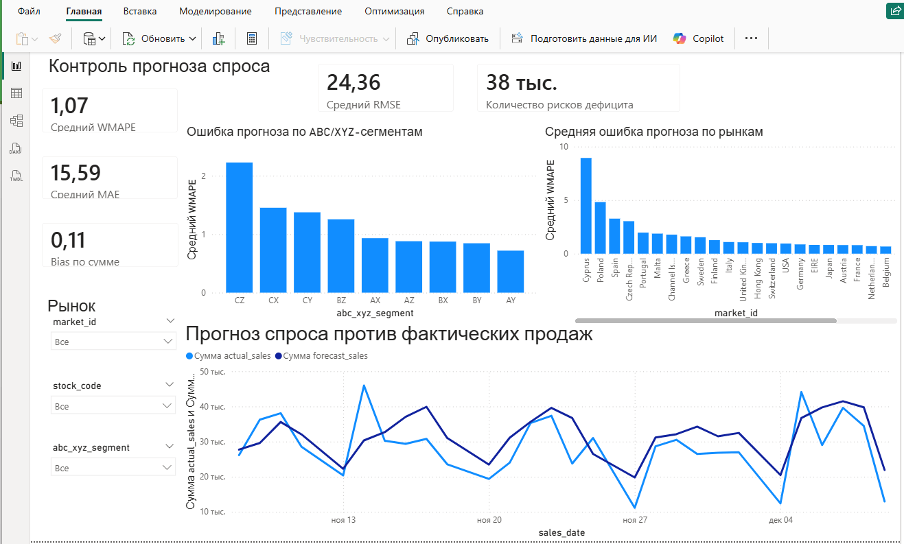

# Прогнозирование спроса и управление товарными запасами в онлайн-ритейле

Аналитический проект на SQL и Python: от транзакционных данных и витрины продаж до прогноза спроса, оценки ошибки и сценарной оценки рисков дефицита и избыточного запаса.

## Краткое описание

Проект показывает полный аналитический кейс для онлайн-ритейла: загрузка транзакций, очистка данных, сборка SQL-витрин, прогноз спроса и сценарная оценка товарных рисков. Бизнес-задача — понять, по каким товарам и рынкам прогноз ошибается сильнее всего и какие позиции требуют внимания менеджера. Используются данные UCI Online Retail II или UCI Online Retail, которые пользователь вручную кладет в `data/raw/`. На выходе аналитик получает витрину продаж, сегментацию ABC/XYZ, прогноз, метрики качества, сценарные proxy-метрики stockout / overstock risk и датасет для Power BI. Для работодателя проект полезен тем, что объединяет SQL, Python, time-series validation, интерпретацию метрик и бизнес-выводы в одном воспроизводимом кейсе.

## Бизнес-вопрос

Как на основе исторических транзакций оценить будущий спрос по товарам и рынкам, найти товары с высокой ошибкой прогноза и выделить позиции с риском дефицита или избыточного запаса?

## Почему это важно для бизнеса

Ошибка прогноза влияет на закупки, доступность товара и объем денег, связанных в товарном запасе. Переоценка спроса ведет к сценарию избыточного запаса, а недооценка спроса повышает сценарный риск дефицита. ABC/XYZ-сегментация помогает сфокусироваться на товарах, где ошибка особенно важна: например, товары с большим вкладом в выручку и нестабильным спросом требуют более внимательного контроля. Power BI dashboard помогает быстро находить проблемные товары, рынки и сегменты, не просматривая таблицы вручную.

## Данные

Источник данных: UCI Online Retail II или UCI Online Retail. Это транзакционные данные онлайн-ритейлера.

Ожидаемые поля:

- `Invoice`;
- `StockCode`;
- `Description`;
- `Quantity`;
- `InvoiceDate`;
- `Price` или `UnitPrice`;
- `Customer ID` или `CustomerID`;
- `Country`.

Преобразования:

- `sales_date` создается из `InvoiceDate`;
- `stock_code` создается из `StockCode`;
- `market_id` создается из `Country`;
- `revenue = Quantity × Price/UnitPrice`;
- возвраты и отмененные заказы помечаются отдельным флагом;
- целевая переменная для прогноза — `net_sales_qty`.

Сырые данные не хранятся в репозитории.

## Как подготовить данные

1. Скачать UCI Online Retail II или UCI Online Retail.
2. Положить файл в `data/raw/`.
3. Переименовать файл в `online_retail_II.xlsx` или `online_retail.xlsx`.
4. Запустить notebooks по порядку.

## Что сделано в проекте

- Загрузка и нормализация транзакционных данных.
- Проверки качества данных: пропуски, отрицательные цены, возвраты, дубли, даты.
- Сборка ежедневной витрины `sales_date × stock_code × market_id`.
- ABC/XYZ-сегментация товаров.
- Генерация лаговых и rolling-признаков.
- Baseline-модели: naive, seasonal naive, moving average, median by weekday.
- Модель прогноза спроса.
- Валидация по времени с holdout-периодом.
- Расчет WMAPE, MAE, RMSE и bias.
- Сценарная оценка stockout / overstock risk.
- Расчет reorder point и safety stock.
- Power BI dashboard из двух страниц.

## Структура репозитория

```text
data/        # raw, interim и processed данные; сырые файлы не коммитятся
notebooks/   # пошаговый аналитический сценарий
sql/         # SQL-схема, витрина продаж, признаки и inventory-метрики
src/         # Python-модули для проверок, признаков, прогноза, метрик и запасов
reports/     # текстовые выводы и инструкции для dashboard
results/     # расчетные CSV после запуска notebooks
assets/      # скриншоты Power BI dashboard
tests/       # unit-тесты ключевой логики
```

## Как запустить проект

Windows PowerShell:

```powershell
python -m venv .venv
.\.venv\Scripts\Activate.ps1
python -m pip install --upgrade pip
pip install -r requirements.txt
python -m pytest -q
```

Если PowerShell блокирует активацию:

```powershell
Set-ExecutionPolicy -Scope Process -ExecutionPolicy Bypass
.\.venv\Scripts\Activate.ps1
```

Запуск без активации окружения:

```powershell
.\.venv\Scripts\python.exe -m pip install -r requirements.txt
.\.venv\Scripts\python.exe -m pytest -q
```

## Порядок запуска notebooks

1. `notebooks/01_загрузка_и_проверка_данных.ipynb`
2. `notebooks/02_eda_abc_xyz_сегментация.ipynb`
3. `notebooks/03_признаки_baseline_и_валидация.ipynb`
4. `notebooks/04_модель_прогноза_и_ошибка.ipynb`
5. `notebooks/05_запасы_риски_и_бизнес_выводы.ipynb`

После notebooks можно собрать единый датасет для Power BI:

```powershell
python scripts/build_dashboard_dataset.py
```

## Основные результаты

По расчетным CSV в `results/` лучшая baseline-модель по WMAPE: `median_by_weekday`.

Сравнение на holdout-периоде:

| Подход | WMAPE | MAE | RMSE | bias |
|---|---:|---:|---:|---:|
| Лучшая baseline (`median_by_weekday`) | 0.8574 | 16.4548 | 106.0949 | -0.2835 |
| Модель прогноза | 0.7996 | 15.5885 | 77.1190 | 0.1052 |

Модель прогноза показала меньшую ошибку на holdout-периоде по WMAPE, MAE и RMSE, но bias отличается по направлению: baseline занижает спрос, а модель в среднем завышает его. Сегменты с наибольшей средней ошибкой по dashboard-датасету: `CZ`, `CX`, `CY`, `BZ`, `AX`. Среди строк с высокой абсолютной ошибкой встречаются товары и рынки: `84826 / United Kingdom`, `22197 / United Kingdom`, `23084 / Japan`, `84077 / United Kingdom`.

Сценарный слой запасов выделил товары и рынки для контроля: в расчете по модели есть `3531` групп с proxy-флагом stockout risk и `6004` групп с proxy-флагом overstock risk из `6837` групп. Эти значения не являются фактическими складскими событиями: они показывают сценарную оценку риска на основе прогноза и допущения о доступном запасе.

Ограничения результатов:

- качество прогноза зависит от полноты и корректности транзакций;
- результаты на holdout не доказывают экономический эффект;
- stockout и overstock трактуются только как сценарные proxy-метрики;
- для практического применения нужны реальные остатки, lead time, закупочные ограничения и стоимость хранения.

## Power BI dashboard

Dashboard строится на файле `results/dashboard_forecast_inventory.csv`.

### Контроль прогноза

Содержит:

- WMAPE;
- MAE;
- RMSE;
- bias;
- количество товаров с риском дефицита;
- график `actual_sales` vs `forecast_sales`;
- ошибка прогноза по рынкам;
- ошибка прогноза по ABC/XYZ-сегментам;
- срезы по `market_id`, `stock_code` и `abc_xyz_segment`.



### Запасы и бизнес-риски

Содержит:

- средний reorder point;
- средний safety stock;
- количество рисков дефицита;
- количество рисков избытка;
- матрицу риска дефицита по рынкам и ABC/XYZ-сегментам;
- scatter plot "выручка vs ошибка прогноза";
- таблицу товаров для внимания менеджера.



## Ограничения анализа

- В исходных данных нет фактических складских остатков.
- Stockout и overstock — сценарные proxy-метрики.
- Результаты не являются доказанным causal effect.
- Качество прогноза зависит от полноты транзакционных данных.
- Возвраты и отмененные заказы могут искажать спрос, поэтому они помечаются отдельно.
- Для реального внедрения нужны остатки, lead time, закупочные ограничения и стоимость хранения.

## Что проект показывает работодателю

Проект показывает, что автор умеет:

- собирать аналитическую витрину;
- проверять качество данных;
- работать с транзакционными retail-данными;
- строить признаки для временных рядов;
- сравнивать baseline и модель прогноза;
- валидировать прогноз по времени;
- интерпретировать ошибку прогноза;
- переводить результат анализа в понятные бизнес-рекомендации;
- оформлять результат в Power BI dashboard.

## Как рассказать проект на интервью

Я взял транзакционные данные онлайн-ритейлера, очистил их, отдельно обработал возвраты и отмененные заказы, собрал ежедневную витрину продаж на уровне товар × рынок. Затем сделал ABC/XYZ-сегментацию, построил лаговые и rolling-признаки, сравнил несколько baseline-подходов и модель прогноза на holdout-периоде. После оценки WMAPE, MAE, RMSE и bias я перевел прогноз в сценарные метрики риска дефицита и избыточного запаса. Итогом стал Power BI dashboard, где можно увидеть качество прогноза, проблемные рынки, товарные сегменты и позиции, требующие внимания менеджера.

## Файлы, которые стоит смотреть

- `README.md`
- `notebooks/`
- `sql/`
- `src/`
- `reports/выводы_для_работодателя.md`
- `reports/dashboard_instructions.md`
- `assets/dashboard_forecast_control.png`
- `assets/dashboard_inventory_risks.png`

## Лицензия

Проект распространяется под лицензией MIT. Подробнее см. файл [LICENSE](LICENSE).
